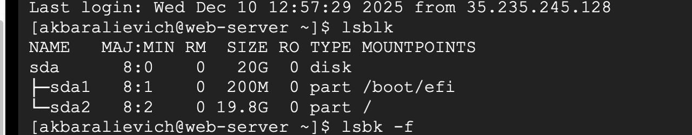
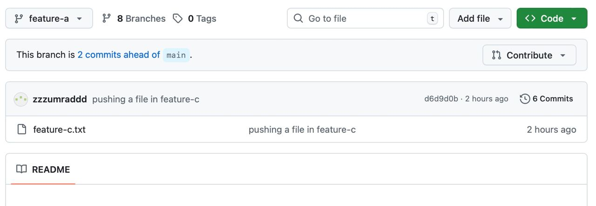
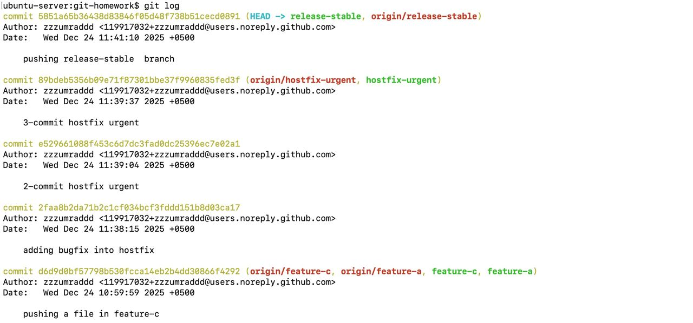
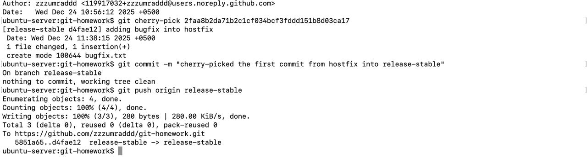
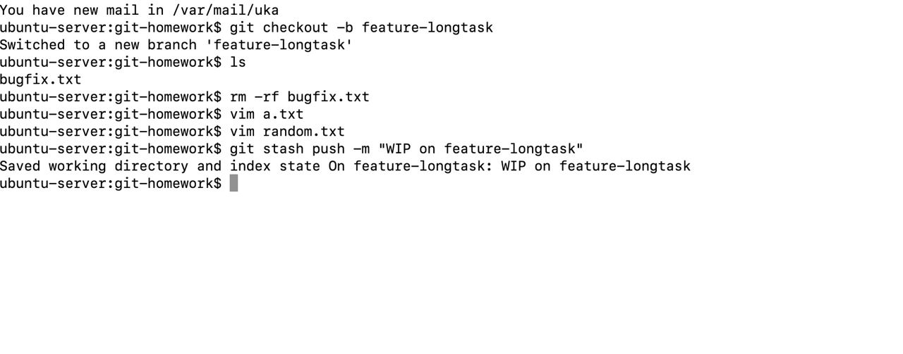
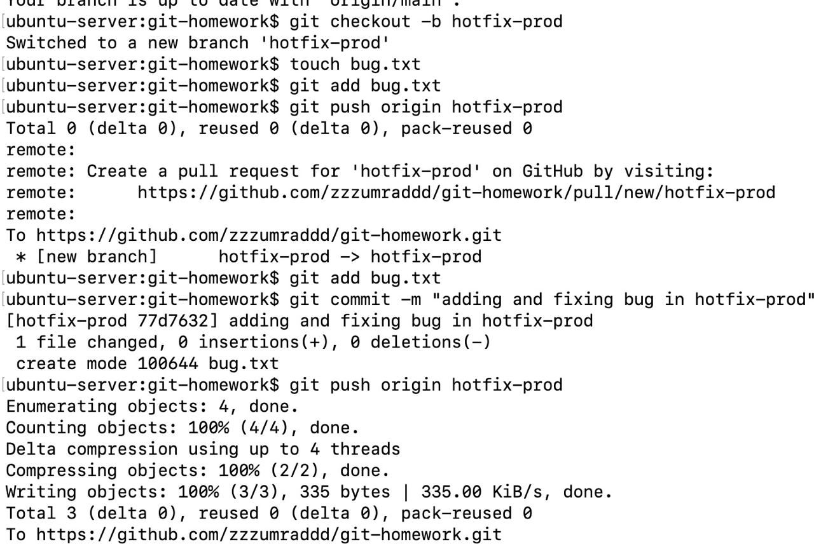

# 9-lesson 

# 1-task

🔀 1. Branching & Merging
  Create a new repo named git-homework.
  Create a branch called feature-a.
  Add a file feature-a.txt with sample content.
  Switch back to main and create another branch feature-b.
  Add feature-b.txt with different content.
  Merge feature-a and feature-b into main. Handle any merge conflict if occurs.

# 2-task

🔁 2. Git Rebase
  Create a new branch feature-c from main.
  Make 2 commits on feature-c.
  Rebase feature-c onto feature-a and explain the changes.

    git checkout feature-a

    Switched to branch 'feature-a'

    git rebase feature-c

## 3-task

🎯 3. Cherry-pick
  Create branch hotfix-urgent from main
  Commit: Add a fix (e.g., to bugfix.txt)
  Then make 2 additional non-related commits on the same branch
  Go to a new branch release-stable
  Cherry-pick only the hotfix commit, not the others
✅ Explain in the README how you selected the right commit and avoided others

I used git log to see the history of commits and chose the needed one(copied hash code)

# 4-task

🥡 4. Stashing
You’re in the middle of a feature when a production bug comes up.
Steps:
  On feature-longtask, make some uncommitted changes
  Use git stash push -m "WIP on feature-longtask"
  Switch to main, create a branch hotfix-prod, fix and commit a bug
  Return to feature-longtask, re-apply the stash
✅ Then run git stash list and git stash show -p and include output or screenshots

## Additional questions 

1. git merge and git rebase orasidagi farq ozbekchada izohlang?
 
    Merge - ikki branchning historylarini           birlashtiradi va yangi merge commit yaratadi. Asl commit historylari o'z joyida saqlanadi.

    Rebase - bir branchning commitlarini boshqa branchning ustiga ko'chirib, qayta yozadi. Natijada linear history hosil bo'ladi. Eski commitlar o'chirilmaydi, lekin ular endi "reach" emas (murojaat qilib bo'lmaydi).

2. Merge yoki rebase dan kora qachon cherry-pick ishlatgan bolardingiz?

Agar boshqa branchdagi specific commitni current branchga apply qilmoqchi bo'lsak 

3. Git stage lari qanday ekan?
    1) Working directory, where you directly create, edit, and delete files)
    2) Staging area(Index), "prep zone" for changes before the become a permanent part of the project history(git add)
    3) Local repository 
4. Git stash bizga qanday yordam berar ekan?
  Git vaqtincha uncommited changelarni saqlab turadigan joy (local 'stash'), bu bizga commit historyni tugallanmagan tasklar bilan to'ldirib mess yaratishdan yordam beradi. 

5. Git squash dan maqsad nima va uni qachon ishlatish kerak?

Bir nechta ketma-ket commitlarni bitta commitga birlashtirish. Bu commit historyni tozalash va soddalashtirishga yordam beradi
  
6. Soft, mixed, va hard reset lar orasidagi asosiy farq?

git reset --soft
HEAD orqaga 
Staging area (Index) → Saqlanadi (staged)
Working directory → Saqlanadi

git reset --mixed (default)

HEAD orqaga
Staging area →  Tozalanadi (unstaged)
Working directory → Saqlanadi

git reset --hard

HEAD orqaga 
Staging area → Tozalanadi
Working directory → Tozalanadi 
  
7. Nega git stash pop xavfliroq?

git stash apply - stash list'da saqlanib qoladi, conflict'ni hal qilganingizdan keyin yana apply qilishingiz mumkin

git stash pop - stash list'dan o'chirib tashlanadi, conflict yuzaga kelsa ham. Agar conflict'ni noto'g'ri hal qilsangiz, stash yo'qolgan bo'ladi.

Shuning uchun pop xavfliroq - conflict holatida stashni yo'qotish xavfi bor.
